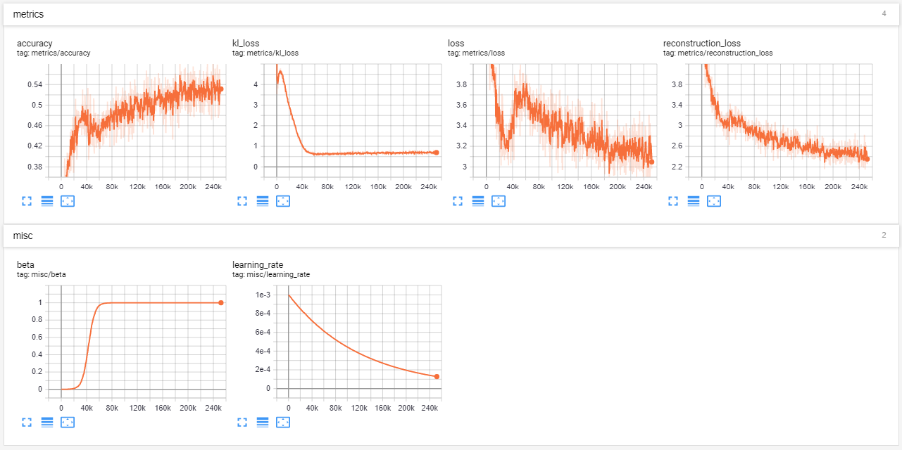

# Variational Autoencoder for Texts
Very loose implementation of [Generating Sentences from a Continuous Space](https://arxiv.org/abs/1511.06349).

## Dataset and Preprocessing
The dataset used in this repo is [IMDB Review Dataset](https://www.kaggle.com/utathya/imdb-review-dataset). 
The dataset is preprocessed as follows:
1. Each string is split by sentence.
1. Characters are all lower-cased.
1. No words are removed, common punctuations (comma, period, question mark) are preserved and treated as a word.
1. Dataset is split into training and testing set.
1. Only the top 20000 most frequent words in the training set are stored in vocabulary, other words are replaced with a "<unk>" token.  
1. The training set, testing set and Keras word Tokenizer are saved as pickle files.  

Example of preprocessed sentence:  
_Original: Do you think Batman lives under Bruce Wayne's manor?_  
_Preprocessed: do you think batman lives under bruce wayne s manor ?_  

Check __dataset.py__ for more details.

## Training  
The model is described in __seq_vae.py__. The Kullback-Leibler divergence term is multiplied by a weight _beta_ as described in the paper. _Beta_ is annealed from 0 to 1 following a sigmoid schedule as desribed in the paper. The model is trained for 20 epochs.   
  

Check __seq_vae.py__ and __train.py__ for more details and tuning hyperparameters.  

## Results  
```  
usage: test.py [-h] [-m MODE] [-s SENTENCE] [-s1 SENTENCE_1] [-s2 SENTENCE_2]
               [-b BEAM_SIZE] [-r RESTORE_PATH]

optional arguments:
  -h, --help            show this help message and exit
  -m MODE, --mode MODE
  -s SENTENCE, --sentence SENTENCE
  -s1 SENTENCE_1, --sentence_1 SENTENCE_1
  -s2 SENTENCE_2, --sentence_2 SENTENCE_2
  -b BEAM_SIZE, --beam_size BEAM_SIZE
  -r RESTORE_PATH, --restore_path RESTORE_PATH  
```  

#### Reconstruction  
```  
python test.py --mode reconstruct --sentence "the actors are too young for their characters" --beam_size 8 --restore_path vae/vae-20  

1. the actors are too young for them .
2. the actors are too young for their .
3. the songs are too young for them .
4. the actors are too young for her .
5. the actors are too young for some .
6. the songs are not too young .
7. the actors are not too young .
8. the characters are too young for them .  
```

#### Generating random sentences  
```  
python test.py --mode generate --beam_size 8 --restore_path vae/vae-20  

1. that would be the best thing about the previous films today , but this film is packed , and it was a great movie , not a good , dark comedy .
2. that would be the best thing about the previous films today , but this film is packed , and it was a great movie , especially for a good , dark comedy .
3. that would be the best thing about the previous films today , but this film is packed , and it was a great movie , it was a good , classy thriller .
4. that would be the best thing about the previous films today , but this film is packed , and it was a great movie , it was a good , classy movie .
5. that would be the best thing about the previous films today , but this film is packed , and it was a great movie , especially for a good , classy thriller .
6. that would be the best thing about the previous films today , but this film is packed , and it was a great movie , especially for a good , classy comedy .
7. that would be the best thing about the previous films today , but this film is packed , and it was a great movie , it was a good , classy fashion .
8. that would be the best thing about the previous films today , but this film is packed , and it was a great movie , it was a good , classy , inspirational movie .  
```  

#### Interpolating between sentences  
_First and last sentences are the reconstruction of the originals_  
```  
python test.py --mode interpolate --sentence_1 "the movie was not as good as the prequel" --sentence_2 "the actors of the film are too young for their characters" --restore_path vae/vae-20    
1. the movie was not as good as a .
2. the movie was not as good as a .
3. the movie was not as good as <unk> .
4. the acting is great as good as <unk> .
5. the actors in the movie are quite good .
6. the actors of the film are too young for their .
7. the actors of the film are too young for their .  
```  
Check out __test.py__ to vary the number of interpolations, 5 interpolations is a good number to see significant changes between each interpolation.  

## Requirements  
* Tensorflow/Tensorflow-gpu 1.13.1
* NumPy 1.16.3
